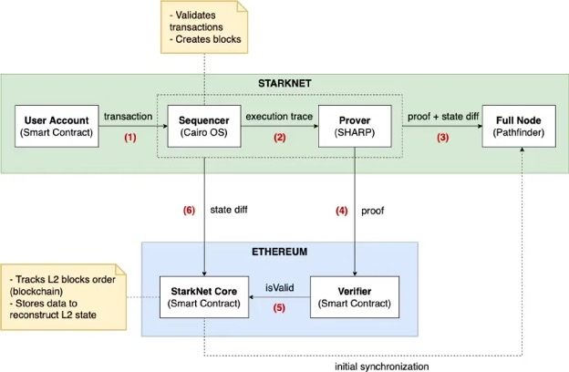

# Cairo 0 安全审计实践指南

# Cairo 简介

Cairo 是一种用于编写可证明程序的编程语言，其中一方可以向另一方证明某项计算被正确执行。Cairo 和类似的证明系统例如 Noir 和 Leo 等可以用来为区块链提供可扩展性。

在 Cairo 中，智能合约的执行被转换为一个解决 R1CS 约束系统的问题。StarkNet 通过使用自己的证明系统来证明这些约束，并保证了智能合约的高性能和低成本。同时，Cairo 语言的可读性和可维护性使得开发者可以更容易地编写和维护智能合约。

**Cairo 程序与合约的区别：**

Cairo 程序：Cairo 程序可以理解为一种无状态合约，由于无状态意味着在编写程序时，不能访问存储，不能与其他 Cairo 程序包括 L1 链进行交互。

Cairo 合约：简单来说，这是运行在 Starknet 虚拟机 (VM) 上的程序。由于在虚拟机上运行，因此他们可以访问 Starknet 的持续状态，改变或修改 Starknet 的变量状态，与其他合约交互，并与底层 L1 无缝交互。

## Starknet 基本工作流程

StarkNet 有五个组成部分。分别是在 StarkNet 上的 Prover（证明者），Sequencer（排序器）和全节点；以及部署在以太坊上的验证者（Verifier）和核心状态合约（StarkNet Core）

 

1、当我们在 StarkNet 上发起一个交易，一个链下服务器——排序器将会接收、排序、验证，并将它们打包到区块。执行交易，然后状态转换发送给 StarkNet Core 合约；  
2、证明者将为交易生成证明，并发送给以太坊的验证者合约；  
3、验证者将验证结果发送到以太坊上的 StarkNet Core 合约，并从 StarkNet Core 合约触发一组新的以太坊交易，以更新链上的全局状态以进行记录保存。状态事务作为“calldata” （EIP-4844后为Blob）来发送，以节省 L1 事务 gas。这些“metadata”可被 StarkNet 全节点解密。  
全节点基本发挥存储功能。全节点存储状态改变、元数据、证明以及记录在 StarkNet 中的已被执行的所有事务，并跟踪系统的当前全局状态。在有必要的时候，全节点将解密“metadata”来重构 StarkNet 的历史。

## Felt

在 Cairo 中有一个原始的数据类型：字段元素，简称 **felt**。felt 是一个整数，其范围是 \-P/2 \< x \< P/2，（看成无符号时是 0 \< x \< P)，其中 P 是一个非常大的素数（252 位）。该数据类型可以储存地址、短字符串（31个字符串）、整数等。

*3618502788666131213697322783095070105623107215331596699973092056135872020481*

## 账户抽象

帐户抽象背后的想法是允许更灵活地管理帐户，而不是在协议级别确定它们的行为。这可以通过引入账户合约来实现——具有确定用户账户的可编程逻辑的智能合约。

在StarkNet中，每个用户都有一个账户，一个账户由一个已部署的合约来表示，该合约定义了账户的逻辑。例如：

1\. 确定签名有效的含义或允许你的账户与哪些合同互动。这被称为 "签名抽象化"

2\. 用不同的代币支付交易费用——这有时被称为“费用抽象”

3\. 设计你自己的重放保护机制，并允许并行发送多个未耦合的交易。与以太坊中使用的顺序nonce解决方案相比，这导致交易是固有的顺序，也就是说，即使你想平行发送两个交易，你必须在发送第二个交易之前等待第一个交易的确认。否则，第二个交易可能由于无效的nonce而被拒绝。通过账户抽象，人们可以讨论不同的解决方案，绕过对顺序性nonce的需求。这被称为 "nonce抽象"

## 基础语法

### 修饰器

```
@storage_var // 指定状态变量

@constructor // 指定构造函数

@external // 指定书写状态变量的函数

@view // 指定从状态变量中读取的函数

@event // 用于指定事件

@l1_handler // 用于指定处理从 L1 合约信息桥所发送信息的函数
```

### 状态变量

合约存储是可书写，浏览和修改数据的持续存储空间。根据官方文档，它有 $2^{251}$ 个插槽，其中每个插槽都是初始化为 0 的 felt。

```
@storage_var
func id() -> (number: felt):
end
```

数据的修改和读取分别采用的是 write() 和 read() 函数

```
id.write(number) // 修改 id 变量

let num = id.read() // 读取 id 变量
```

### 存储映射 (Mapping)

不同于 Solidity 会映射其本身的特殊关键字，Cairo 使用存储变量进行映射。

```
@storage_var
func balance(address: felt) -> (amount: felt):
end
```

数据的修改和读取也一样采用的是 write() 和 read() 函数，只不过要多提供一个参数

```
balance.write(address, amount) // 修改 id 变量

let num = balance.read(address) // 读取 id 变量
```

### 导入模块

`from starkware.starknet.common.syscalls import get_contract_address`

如上示例，Cairo 会在当前目录和相对于编译器路径的标准库目录中搜索文件 syscall.cairo，并从中导入 get\_contract\_address 函数

### 函数

```
func add(a: felt, b: felt) -> (c: felt):
    return (a + b) 
end
```

### Namespace 命名空间

Cairo 命名空间是在合约中使用模块的一种非常强大的方式。当从多个模块导入时，它允许你在一个标识符下定义函数范围，有助于防止冲突。它还有助于提高代码可读性。

```
namespace starklings
    func testAdd(a: felt, b:felt) -> (c: felt):
       return (a+b)
    end
end
```

从文件中使用命名空间中的函数：

`starklings.starkling_exercise(3, 5)`

### 结构体

struct 关键字定义，然后用 member 关键字指定其属性

```
struct Currency:
   member name: felt
   member id: felt
end
```

赋值和读取

```
local euro : Currency = testStr('Euro', 2)

assert euro.name = 'Euro'
```

### 隐式参数

Cairo 函数除了接受显性参数（在 ( ) 之间提供），还接受隐性参数（在 {	} 之间提供）

两者之间的主要区别是，显性参数在函数主体内使用，不能在外部访问，而隐性参数能被其他调用它们的函数所继承。

```
@external
func update_id{
      syscall_ptr : felt*,
      pedersen_ptr : HashBuiltin*,
      range_check_ptr
    }(_number: felt):
    id.write(_number)
end
```

以上例子中，函数接收了三个隐含的参数：

1\. syscall\_ptr \- 这个参数使 Cairo 函数能够被调用

2\. pedersen\_ptr \- 这个参数用于计算 pedersen 哈希值

3\. range\_check\_ptr \- 这个参数用于整数比较

为什么需要传递这些参数？这是因为我们试图写入的存储变量需要这些隐含的参数，以便计算这个变量的实际内存地址。特别是映射类型的存储，计算 Pedersen hash 是 read() 和 write() 工作的一部分。

### 跨链互操作

#### a. 从 L2 向 L1 发送消息

1\. StarkNet 上的 L2 合约调用库函数 send\_message\_to\_l1 来发送消息，它需要传入两个参数：  
to 地址（即 L1 上合约的地址）以及 payload （即消息数据）

2\. 当包含 L2 事务的状态更新在链上被接受打包，消息就会被存储在 L1 StarkNet Core 合约上等待被处理

3\. 由 to 地址指定的 L1 合约调用 L1 StarkNet Core 合约的 consumereMessageFromL2 函数来处理消息

#### b. 从 L1 向 L2 发送消息

1\. L1 上的合约调用 L1 StarkNet Core 合约的 sendMessageToL2 函数，需要传入 to 地址，函数选择器（需要调用的L2 合约的函数）和消息参数，并提供费用

2\. 当费用足够时，StarkNet 的排序器会自动处理消息，消息会被解码成 StarkNet 交易，将调用由 to 地址指定的 L2 合约的函数

3\. 在上一步会创建一个 L1 Handle 交易并添加进证明中

4\. 在 StarkNet Core 合约收到状态更新，消息从核心合约的存储中清除（消息已处理）

# Cairo 安全漏洞

## 溢出漏洞

在 Cairo 中，如果数学运算（加法、减法、乘法）的结果超出了数据类型的范围，Cairo 不会自动 revert 而是会溢出。

```
@view
func overflow{
        syscall_ptr: felt*,
        pedersen_ptr: HashBuiltin*,
        range_check_ptr
        } (num1: felt, num2: felt) -> (res: felt):
        return (num1 + num2)
end
```

在以上程序中，如果我们将 num1 传入 2, num2 传入 felt 可容纳的最大值，则函数会返回 1。  
**Solution: 可以采用 openzeppelin 的库限制溢出问题**

我们可以看到在上面没有提及除法，因为 Cairo 的数学是在一个有限域中完成的，而它的除法与 Solidity 不同在于 Solidity 是直接截断掉小数部分，而 Cairo 的除法应该看作是乘法的逆运算。  
当整除的时候，结果是符合我们的预期的，但是当除数与被除数无法整除时，会返回超出预期的结果。  
例如  7 / 3 时，结果会返回`1206167596222043737899107594365023368541035738443865566657697352045290673496`

这种逆运算导致的结果非预期是需要在审计中需要注意的。

**Solution: 根据项目具体逻辑可以考虑使用 uint256 模块来替代 felt 数据类型进行除法计算**

## 重入漏洞

即使 StarkNet 中没有原生代币回调，各种标准（ERC721.onerc721received、ERC777.tokensReceived等）中的不安全实现或回调仍然可能受到重入攻击。

```
@external
func withdrawAll{
    syscall_ptr : felt*,
    pedersen_ptr : HashBuiltin*,
    range_check_ptr
}():
    alloc_locals
    let (caller) = get_caller_address()
    let (bal) = balance.read(caller)
    assert_not_zero(bal)
    let (token) = token.read()    
    IERC777.transfer(token, caller, bal)
    
    balance.write(caller, 0)
    return ()
end
```

上面的 withdrawAll() 函数容易受到重入攻击。攻击者可以通过实现恶意的 ERC777.tokensReceived 回调函数来重新进入 withdrawAll() 函数，并从合同中盗取所有代币。

Solution: 实施Check-Effect-Interaction模式或使用 openzepplin 的 ReentrancyGuard 模块

## 

## 权限控制漏洞

### a. 缺少权限验证

在具体业务逻辑中会涉及很多更改系统关键变量的函数，对于敏感的函数需要根据业务设计实施身份验证方案，使用功能 get\_caller\_address() 防止恶意攻击者绕过身份验证或冒充其他用户危害合约正常运行和资金安全。

```
@external
func transfer{
    syscall_ptr : felt*,
    pedersen_ptr : HashBuiltin*,
    range_check_ptr
}(from_addr : felt, to_addr : felt, amount : felt):
    # check the amount is non negative value
    assert_nn(amount)
    let (from_bal) = balance.read(from_addr)
    let (to_bal) = balance.read(to_addr)
    # check overflow/underflow
    assert_nn(from_bal - amount)
    assert_nn(to_bal + amount)
    balance.write(from_addr, from_bal - amount)
    balance.write(to_addr, to_bal + amount)
    return ()
end
```

在上面这段代码中可以看到缺少了对 from 地址的判断导致攻击者可以转移任意用户的资金，具体的修复方式是在转账钱前用 get\_caller\_address() 来进行调用者身份的验证：

`let (from_addr) = get_caller_address()`

**Solution: 对于此类问题的解决办法就是利用 get\_caller\_address() 对调用者的身份作限制，对于敏感函数例如mint()、burn() 等可采用 openzepplin 的 Ownable 和 AccessControl 库进行权限划分**

### b. 缺少零地址检查

由于 Starknet 采用的是账户抽象的模型，所以在 Starknet 中并没有所谓的 EOA 地址，用户通常是通过部署的合约来与其他合约交互。但仍然可以直接与合约进行交互，只不过 get\_caller\_address() 是返回调用此合约的源合约的地址。它可以是账户合约的地址或另一个合约的地址（如果该函数被另一个合约调用）。当直接调用合约而不是通过合约时，该函数返回 0，即调用者被看作是 0 地址。

利用上面同样的 transfer 代码，有一个场景是：  
有个用户不小心或因为错误的设计将代币不小心转移给 0 地址，而此时攻击者就能直接调用合约来获取代币。

**Solution: 采用 assert\_not\_zero 来判断调用者地址是否为 0 地址**

## 不安全的判断方式

### a. 缺少 Uint256 类型检查

由于 Cairo 的基础数据类型 felt 只有 252 位，所以 Cairo 在基本库中设计了 Uint256 的数据类型

```
struct Uint256 {
    // The low 128 bits of the value.
    low: felt,
    // The high 128 bits of the value.
    high: felt,
}
```

由于 felt 是 252 位的，而 Uint256 类型的高低位理论上应该分别是 128 位的，如果没有作合理的检查，可能会导致绕过一些验证逻辑的问题。

```
@view
func check_zero{
        syscall_ptr: felt*,
        pedersen_ptr: HashBuiltin*,
        range_check_ptr
        } (num: Uint256) -> (res: felt);
        let zero: Uint256 = Uint256(0, 0)
        let (check) = uint256_le(num, zero)
        return (check)
end
```

在上述代码中，我们传入一个 Uin256 类型的值，通过 uint256\_le 函数来判断他是否小于 0，如果小于则返回 1

而此时构造一个恶意的 Uint256 值：{"high": 0, "low": 2 \*\* 128 \+ 1}

1\. 跟进 uint256\_le 函数，uint256\_le(Uint256(0, 2 \*\* 128 \+ 1), Uint256(0,0))：

```
func uint256_le{range_check_ptr}(a: Uint256, b: Uint256) -> (res: felt) {
    let (not_le) = uint256_lt(a=b, b=a);
    return (res=1 - not_le);
}
```

2\. 继续跟进 uint256\_lt 函数, uint256\_lt(Uint256(0,0), Uint256(0, 2 \*\* 128 \+ 1)):

```
func uint256_lt{range_check_ptr}(a: Uint256, b: Uint256) -> (res: felt) {
    if (a.high == b.high) {
        return (is_le(a.low + 1, b.low),);
    }
    return (is_le(a.high + 1, b.high),);
}
```

3\. 进入 is\_le( 0 \+ 1, 2 \*\* 128 \+ 1\) 流程:

```
func is_le{range_check_ptr}(a, b) -> felt {
    return is_nn(b - a);
}
```

4\. is\_nn 函数会判断 0 \<= b \-a \< 2 \*\* 128，如果在区间内则返回 1 否则返回 0，由于 (2 \*\* 128 \+ 1\) \- 1 \= 2 \*\* 128 超出了这个范围，所以该函数返回 0

所以会导致 uint256\_le 的结果为 1 \- 0 \= 1，从而通过了小于 0 的检查

**Solution: 用 uint256\_check 函数来检查传入的 Uint256 类型参数**

### b. 不同的比较判断风险

在 Cairo 编程语言中，有两种办法用于进行小于或等于的比较操作：assert\_le 和 assert\_nn\_le

1\. assert\_le(a,b): 无论数字 a 的大小如何，直接判断 a 是否小于等于 b。  
2\. assert\_nn\_le(a,b): 在判断 a 是否小于等于 b 之前，先判断 a 的范围，即需要满足 0 \<= a \< RANGE\_CHECK\_BOUND （2^128）。

一个常见的场景时应该使用 assert\_nn\_le 的时候却使用了 assert\_le，这可能会导致一些问题，因为 assert\_le 没有判断传入参数的范围，这将会导致判断的时候 a 过大导致结果溢出成正数通过判断。

假设一个代码是关于 ERC20 的，其判断数值是否超过最大供应量：

```
@storage_var
func max_supply() -> (res: felt) {
}

@external
func bad_comparison{syscall_ptr : felt*, pedersen_ptr : HashBuiltin*, range_check_ptr}() {
    let (value: felt) = ERC20.total_supply();
    assert_le{range_check_ptr=range_check_ptr}(value, max_supply.read());

    // do something...

    return ();
}

@external
func better_comparison{syscall_ptr : felt*, pedersen_ptr : HashBuiltin*, range_check_ptr}() {
    let (value: felt) = ERC20.total_supply();
    assert_nn_le{range_check_ptr=range_check_ptr}(value, max_supply.read());

    // do something...

    return ();

    
}
```

在第一个函数中，实际上是可以做到 value 超过 max\_supply 的，因为 assert\_le 函数不会验证传入的 value 的范围可能会因为溢出通过判断

 

而第二个函数限制了范围，更加安全  
 

**Solution: 在审计时需要仔细检查所有涉及 felt 数据类型的比较操作，根据具体业务需求选择合适且正确的比较方式。**

## 跨链安全漏洞

一个好的 L2 系统的一个重要特性是能够与其构建的 L1 系统进行交互，在 StarkNet 中的合约都可以向任意 L1 合约发送消息或从 L1 合约接受消息进行通信。但在两条链中发送数据可能会导致复杂的跨链攻击。

### a. 缺少来源检查

```
@l1_handler
func deposit{
    syscall_ptr : felt*,
    pedersen_ptr : HashBuiltin*,
    range_check_ptr
  }(
    from_address : felt,
    l2_recipient : felt,
    amount : felt,
    sender_address : felt,
  ):
    let (token) = _token.read()
    IToken.mint(token, l2_recipient, amount)
    deposit.emit(l2_recipient, amount)
    return ()
end
```

上面这个例子的场景是：当用户在 L1 上进行存款或抵押时，L1 发送消息给 L2，这个 L2 合约在给用户在 L2 上的地址铸造对应的代币。而很明显可以看出这个合约并没有对 from\_address 参数即来源地址进行验证，所以攻击者可以从任何 L1 合约中发送欺骗性的存款信息，并在 L2 上进行存款。所以需要在代码中加入一个对来源地址的验证：

```
# check the from_address
let (l1_bridge) = _l1_bridge.read()
assert from_address = l1_bridge
```

**Solution: 对于互相交互的 L1 和 L2 地址需做好来源的验证以防被伪造的消息欺骗**

### b. 缺少取消功能

当 L1 向 StarkNet 发送消息进行交互时，消息需要与 L2 合约上所调用的函数选择器一起发送到排序器。在文档中指出，诚实的排序器会自动处理 L1 \-\> L2 的消息，但这并不是由协议强制执行的。如果 gas 价格突然飙升并且提供的费用过低，则会导致消息无法处理。

如果在类似上面的存款场景中，排序器并没有处理 L1 \-\> L2 的存款消息，而此时合约没有取消的功能的话，这将会导致用户的资产被锁在合约中无法取出。

**Solution: 当从 L1 向 L2 发送消息时，需要考虑到排序器没有处理消息的情况，可以试试采用 startL1ToL2MessageCancellation 和 cancelL1ToL2Message 函数来取消进行的消息，并设计相应的函数来取出用户的资产或回滚用户的状态。**

## 重放攻击漏洞

和 Solidity 中类似，主要包括三个类型：常规的直接签名重放、跨链签名重放（测试网上的签名可以在主网上重放）、签名延展性问题

这些攻击的一个关键要点是没有始终确保使用唯一值，也就是 nonce 值

```
@storage_var
func nonces(address: felt) -> (nonce: felt):
end
```

在调用函数过程中要保证更新 nonce 值，并且在签名和验证签名时需将 nonce 值作为关键参数参与。

跨链签名重放可以采用类似 Solidity 合约中的办法，使用一个带有 ChainId 和数据的 hash domain separator 来识别不同链和合约。

**Solution: 将实时更新的 nonce 参与签名和验证，对于跨链重放做好不同 separator 的识别**

## 命名空间存储变量冲突漏洞

（该问题存在于 cairo-lang 0.10.0 之前）  
在 Cairo 中的存储变量不受命名空间的范围限制，如果开发人员不小心在两个不同的命名空间中使用了相同的变量名，则可能会导致存储冲突。

示例代码：

```
from library.a import A
from library.b import B

@external
func increase_balance_a{
        syscall_ptr : felt*, pedersen_ptr : HashBuiltin*,
        range_check_ptr}(amount : felt):
    A.increase_balance(amount)
    return ()
end

@external
func increase_balance_b{
        syscall_ptr : felt*, pedersen_ptr : HashBuiltin*,
        range_check_ptr}(amount : felt):
    B.increase_balance(amount)
    return ()
end
```

我们分别导入了 A 和 B 命名空间，它们分别有两个增加余额的函数 increase\_balance\_a 和 increase\_balance\_b，并且两个命名空间中的余额变量名都为 balance。当我们先后调用不同命名空间增加余额的函数后，分别调用两个命名空间里各自的查询余额的函数，会发现 balance 余额被增加了两次。

**Solution: 检查导入的命名空间的变量名是否冲突**

## View 函数可修改状态风险

在 Solidity 中，view 修饰器所修饰的函数不会修改状态，但是在 Starknet 中并未强制执行该操作。开发人员在设计 view 函数或其他合约调用 view 函数时需要注意这一点，如果不小心包含状态变量的改变，可能会导致非预期的风险。

**Solution: 仔细检查所有的 @view 函数确保其不会更改状态**

## 其他漏洞

预言机操控、逻辑漏洞、治理攻击、......

---

参考  
[https://www.cairo-lang.org/docs/hello\_cairo/index.html](https://www.cairo-lang.org/docs/hello\_cairo/index.html)  
[https://docs.starknet.io/documentation/](https://docs.starknet.io/documentation/)  
[https://github.com/starkware-libs/cairo](https://github.com/starkware-libs/cairo)  
[https://ctrlc03.github.io/](https://ctrlc03.github.io/)  
[https://github.com/crytic/building-secure-contracts/tree/master/not-so-smart-contracts/cairo](https://github.com/crytic/building-secure-contracts/tree/master/not-so-smart-contracts/cairo) 